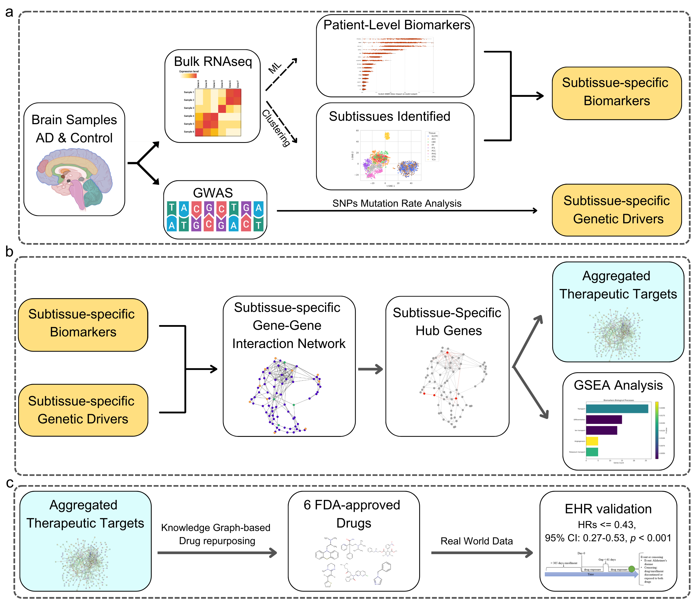

# PRISM-ML: Integrating explainable AI with multiomics systems biology and EHR data mining for personalized drug repurposing in Alzheimer's disease

This repository contains the code and analyses for our paper on the PRISM-ML analysis pipeline, which integrates interpretable machine learning and multi-omics data to identify patient-specific biomarkers and potential drug repurposing candidates in Alzheimer’s Disease (AD). Our goal is to identify novel biomarkers and disease mechanisms that can guide more effective diagnostic and therapeutic strategies.



## Project Overview

Alzheimer’s Disease (AD) is a multifactorial neurodegenerative condition, characterized by complex molecular changes in the brain. Our project employs bulk RNA-seq data and genomic variants from multiple large-scale AD studies to:

- Identify patient-level and subtissue-specific biomarkers using a Random Forest classifier with SHAP (interpretable machine learning).
- Build network models to find critical “bottleneck” genes that link genetic risk factors and expression-based biomarkers.
- Explore multi-target drug repurposing strategies by systematically querying knowledge graphs and validating candidates in real-world data.

## Repository Structure

- **scripts/**: Contains computational notebooks for data processing, analysis, and figure generation.
  - **Part1_RNAseq_data_ML_clustering_biomarkers.ipynb**  
    Implements data loading, cleaning, and interpretable machine learning (Random Forest + SHAP) to identify patient-level AD biomarkers.
  - **Part2_genomics_network_analysis_drug_repurposing.ipynb**  
    Performs network construction, identifies “bottleneck” genes, and carries out a knowledge-graph-based drug repurposing analysis.
  - **Figures_tables_final_statistics.ipynb**  
    Gathers results, generates final figures and tables used in the paper, and calculates summary statistics across tissues.
    
- **figures/**: Stores static resources and figures for this repository.


## Getting Started

To replicate or extend the analysis presented here:

1. **Clone the Repository**  
   ```bash
   git clone https://github.com/your-username/PRISM-ML_AD_Analysis.git
   cd PRISM-ML_AD_Analysis
  
## Data Description

Bulk RNA-Seq: Unified RNA-seq datasets from three major AD cohorts (ROSMAP, MSBB, and MAYO), spanning 2105 post-mortem samples in nine brain regions.

Genomic Variants: Matching genotype data for the same samples, enabling combined transcriptomic and GWAS-based analyses.

Clinical Information: AD diagnosis status and basic demographics (e.g., age, sex).

Note: Actual data files are not uploaded here due to licensing and size constraints. Please refer to the AMP-AD Knowledge Portal or the manuscript for instructions on obtaining the relevant datasets.

These datasets include comprehensive genomic and transcriptomic data essential for multi-layered biomarker analysis.

## Dependencies

- Python 3.11
- Jupyter
- Pandas
- NumPy
- Scikit-learn
- Matplotlib, Seaborn

## License

This project is licensed under the MIT License.

## Contact

For questions, collaborations, or code issues:

Mohammadsadeq Mottaqi: mmottaqi@gradcenter.cuny.edu

Lei Xie: lxie@iscb.org


## Acknowledgments

This work was supported by grants from the NIH (R01GM122845, R01AG057555, R21AG083302) and NSF (2226183). We thank the AMP-AD Consortium, ROSMAP, MSBB, and Mayo Clinic teams for data access.
